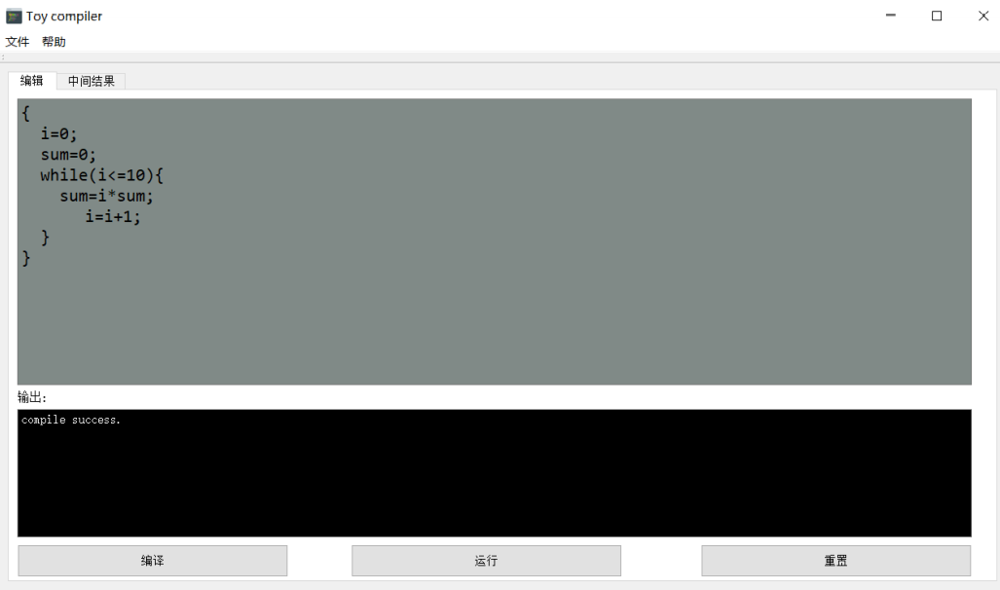
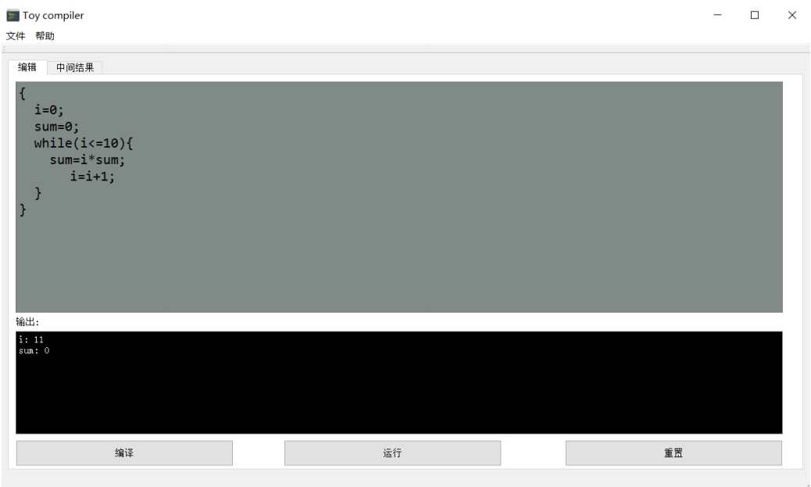
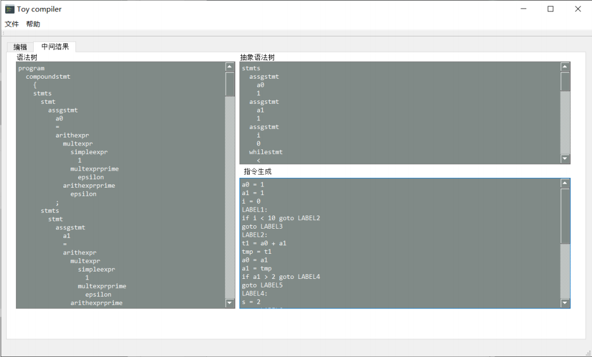
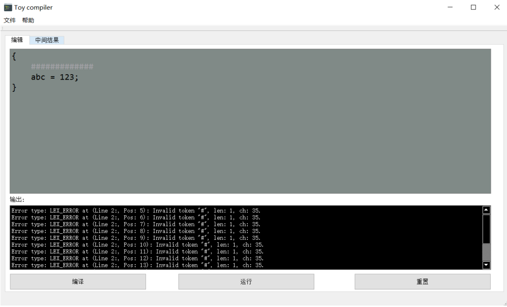
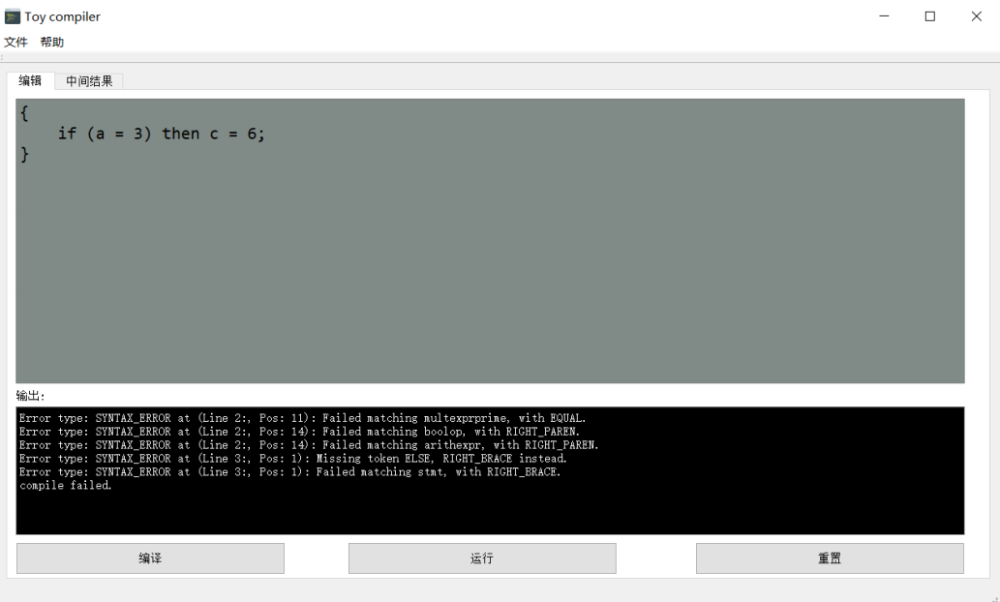

# 编译原理课程项目：Toy

## 1. 计划开发工期

|进度|计划工期|（基本功能）实际完成工期|
|:---:|:---:|:---:|
|scanner|2.5天|1.5天|
|parser|2.5天|4天|
|代码生成|3天|3天|
|虚拟机实现|3天|1天|
|GUI界面|7天|7天|

## 2. 图形化界面

### 2.1. 编译

### 2.2. 虚拟机运行

### 2.3. 中间结果

### 2.4. 词法错误

### 2.5. 语法错误

### 2.6. 语义错误

## 3. 各部分特性

### 3.1. scanner

+ [ ] 缓冲区(double buffering)
+ [x] lexer(scanning on demand)
+ [x] 错误处理(直接跳过error token)

### 3.2. parser

+ [x] LL(1) table generator
+ [x] LL parser
+ [x] syntax tree output
+ [x] 错误处理(panic mode)

### 3.3. semantic analysis

+ [x] 符号表
+ [x] 语义分析

### 3.4. code generation

+ [x] parser tree -> ast tree
+ [x] ast tree -> 三地址码生成

### 3.5. virtual machine

+ [x] 虚拟机实现

### 3.6. visualization

+ [ ] 多叉树生成算法
+ [x] UI界面

### 3.7. 其它部分

- [x] c单元测试
- [x] qt可视化显示，[UI参考1](https://mashplant.online/minidecaf-frontend/), [UI参考2](https://github.com/yunwei37/MIPS-sc-zju)
- [ ] IR代码优化

## 4. reference

- *Engineering a compiler*
- *编译原理实验手册1，2，3，4  南京大学计算机科学与技术系 许畅等*
- *Compilers: Principles, Techniques, and Tools*
- *qt UI参考：https://github.com/yunwei37/MIPS-sc-zju*
